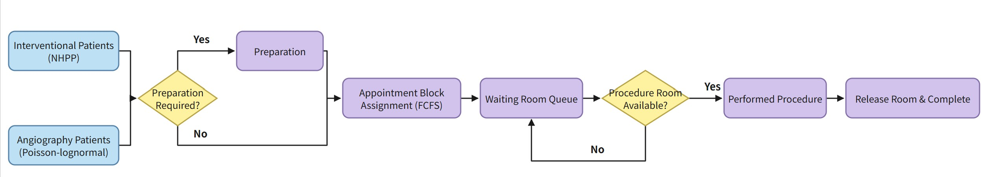

# Interventional Radiology Hospital Simulation Model

This repository contains a discrete-event simulation and optimization framework for outpatient scheduling in an interventional radiology setting. The project combines input-model fitting, a weekly appointment-capacity policy represented by `Qik`, and several optimization approaches to compare scheduling policies under a common simulation model.

## Reproducing the Main Results

To reproduce the final evaluation and analysis shown in the report:

1. Run `evaluate_policy.py`.
   This script evaluates the selected policies from the optimization methods using 100 simulation replications and stores the replication-level results in the `evaluate_policy/` folder. The evaluation uses fixed random seeds, so rerunning it with the same settings will reproduce the same results.
2. Run `Result_Analysis.py`.
   This script reads the evaluation outputs, creates summary tables, computes 95% confidence intervals, and generates the comparison plots.

## 1. Input Analysis

The raw data used for fitting the simulation inputs is stored in `df_selected.xlsx`.

- `arrival_rate.py` analyzes arrival patterns for the two patient classes.
- `service_rate.py` fits the preparation-time, procedure-time, and lateness distributions.
- The selected fitted input models are saved in `arrival_model_params.json` and `services rate.json`.
- Diagnostic plots for the fitted models are saved in `arrival_rate_plot/` and `serivce_rate_plot/`.

## 2. Simulation Model

The main simulation logic is implemented in `simulation_model.py`. It is a discrete-event simulation of the outpatient booking and procedure process for two patient classes: Interventional and Angiography. SimClasses.py, SimFunctions.py and SimRNG.py are used to support the simulation moodel.

At a high level, the model works as follows:

1. Patient orders arrive over time according to class-specific arrival models.
2. Each patient is assigned a preparation type, and a preparation duration is sampled.
3. Once preparation is complete, the patient becomes ready to schedule.
4. The scheduler books the patient into the earliest feasible future appointment slot allowed by the weekly timetable and the `Qik` capacities.
5. The patient arrives for the appointment after the scheduled time plus a sampled lateness delay.
6. If the procedure room is free, service starts immediately; otherwise, the patient waits in a FIFO queue.
7. When the procedure ends, the room is released, overtime is recorded, and the next waiting patient begins service if one is available.
8. At the end of the run, the model summarizes performance using:
   - `Z1`: waiting-time performance
   - `Z2`: overtime performance
   - `Z3`: congestion performance
   - `H`: the weighted objective used for policy comparison

The simulation flowchart is shown below:

The model depends primarily on `input_loader.py` to load the fitted arrival and service distributions used by the simulation.

## 3. Optimization

This repository includes three optimization approaches for searching for good scheduling policies:

- `Optimization_SAA2.py`: sample average approximation based optimization  -- 15 minutes to run
- `Optimization_Subset_Selection+KN_simplified.py`: subset-selection and Kim-Nelson based ranking-and-selection approach -- 3 hours to run
- `Optimization_Lin_Stage2.py`: linearized stage-2 improvement procedure   -- 2 minutes to run

Their outputs are saved in:

- `SAA2_output_folder/`
- `optimization_subset_selection_kn_simplified_outputs5/`
- `optimization_lin_stage2_outputs/`

## 4. Policy Evaluation and Result Analysis

- `evaluate_policy.py` re-evaluates the selected policies under a common validation setting and stores the full replication-level outputs in `evaluate_policy/`.
- `Result_Analysis.py` reads those evaluation results, produces summary tables, computes 95% confidence intervals, and creates comparison plots in `result_analysis_outputs/`.

## Main Output Folders

- `evaluate_policy/`: replication-level validation results for the selected policies
- `result_analysis_outputs/`: summary tables and plots used for final comparison
- `SAA2_output_folder/`: outputs from the SAA optimization
- `optimization_subset_selection_kn_simplified_outputs5/`: outputs from the subset-selection and KN procedure
- `optimization_lin_stage2_outputs/`: outputs from the linear stage-2 method

* Notice old_folder only includes old_version of the py and ipynb files to track the progress. Not count in the submission. 